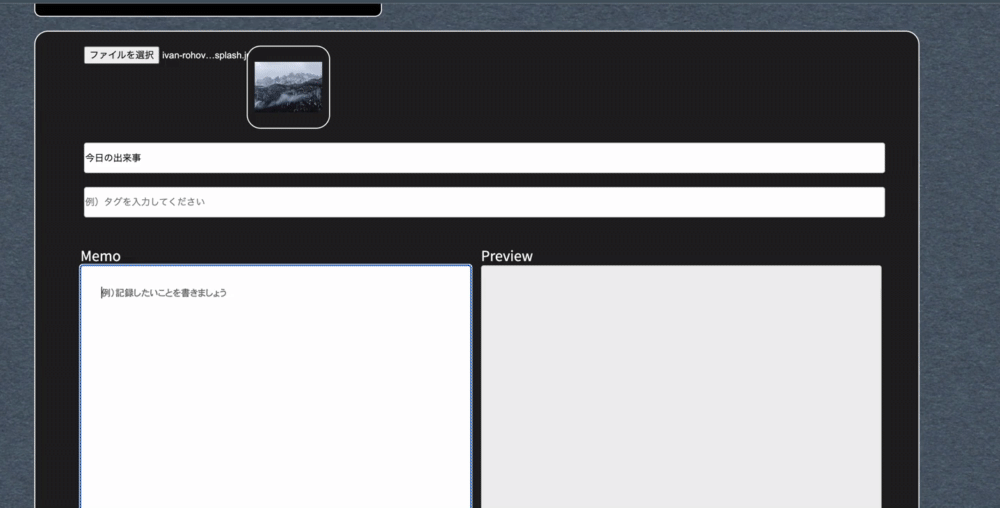
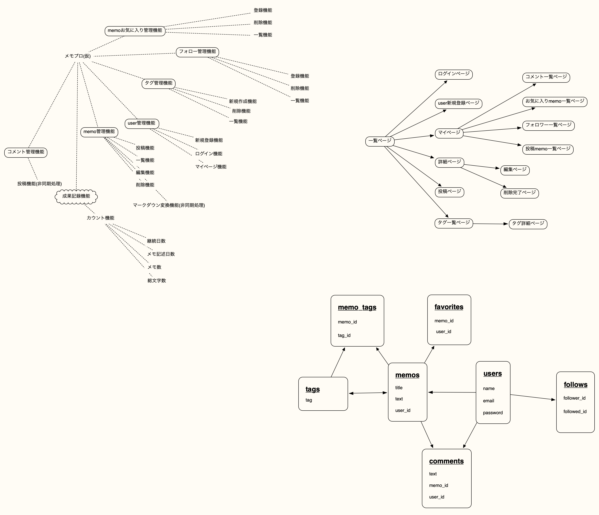

# 目次
1. [アプリケーション名](#anchor1)
1. [アプリケーション概要](#anchor2)
1. [URL](#anchor3)
1. [テスト用アカウント](#anchor4)
1. [利用方法](#anchor5)
1. [アプリケーションを作成した背景](#anchor7)
1. [洗い出した要件](#anchor8)
1. [実装した機能についての画像やGIFおよびその説明](#anchor9)
1. [実装予定の機能（2022](#anchor10)
1. [データベース設計、画面遷移図](#anchor11)
1. [開発環境](#anchor12)
1. [ローカルでの動作方法](#anchor13)
1. [工夫したポイント](#anchor14)
1. [テーブル設計](#anchor15)

 

# アプリケーション名
## メモプロ

 

# アプリケーション概要
プログラミング学習には継続が大切！

だからと言って「Qiita」は初心者が継続的に書き込むのは難しい。

マークダウン対応の投稿機能を搭載した「メモプロ」は「報酬機能」と「ユーザー同士の交流」によりモチベーションを高めて継続的な記録をつけることを可能にします！

- マークダウン形式で投稿できる。
- マークダウンでのライブプレビューが使用できる。
- レスポンシブルなビューデザインで飽きさせない。
- 投稿数やログイン数が一定に達すると新たなアバターが獲得できます。（アチーブメントシステム：未実装）
- フォロー機能、チャット機能でユーザー同士がコミュニケーションをとれる。

 

# URL
https://memopro.onrender.com

 

# テスト用アカウント
- Basic認証バスワード：2222
- Basic認証 ID：admin

### user01
- メールアドレス：111@111
- パスワード：tec111

### user02
- メールアドレス：222@222
- パスワード：tec111

 

# 利用方法
## メモを投稿する
1. トップページのヘッダーからユーザーの「新規登録」。
2. トップページのヘッダーから「メモする」。
3. フォームから「タイトル」を入力し、「memo」のフィールドにメモを入力してください。（「タグ」は未実装、「画像」は任意で一枚までです。）

## メモにコメントする
1. トップページ（一覧ページ）からメモの「タイトル」をクリックしメモ詳細ページへ遷移。
2. メモ詳細ページの右側のコメントフォーム（マークダウン入力対応）に任意に入力し「コメントする」をクリック。

 

# アプリケーションを作成した背景
何かを習得するには継続が必要ですが、「挫折」がつきものでもあります。

私は10年前にプログラミングを勉強したいと思いチャレンジしましたが、すぐに挫折してしまいました。

継続するために一番大切なことはモチベーションだと私は思います。
そして、モチベーションの維持に大切なことは
1. 「目標」
2. 「報酬」
3. 「仲間」

だと思うのです。

なので、このアプリは「報酬（アチーブメントシステム）」と「ユーザーが相互に交流できるシステム」を提供して小さな積み重ね（アウトプット）で「目標」を達成する手助けができるように願って作成しました。

毎日大きな成果を出さなくていい、メモを残す程度の気持ちで継続していけばよいという考えから投稿するのは「メモ」としました。また「メモプロ」というアプリ名は「make progress:成長する」をもじっています。

昔の私やプログラミング初心者に自分の「目標」を叶えるために使って欲しいアプリです。

 

# 洗い出した要件（設計時）
[要件定義書](https://docs.google.com/spreadsheets/d/1D7XnXH0SzGXfXFlsWgLIIsHFgLp6_I_xAlABC5Hvs0w/edit#gid=1785908763)

 

# 実装した機能についての画像やGIFおよびその説明
- マークダウンプレビュー機能

 

- レスポンシブルなview

 

# 実装予定の機能（2022.2.5）
- タグ機能（2022.2.7に一部実装）
- フォロー機能
- お気に入りメモ機能
- アバター機能：ユーザーがアバターを選択できる（2022.2.7に実装）
- アチーブメントシステム：メモ投稿数やログイン日数などの条件を満たすと報酬がもらえる（アバター解禁など）

 

# データベース設計、画面遷移図

 

# 開発環境
- フロントエンド
- バックエンド
- インフラ
- テスト
- テキストエディタ
- タスク管理

 

# ローカルでの動作方法
### 以下のコマンドを順に実行。
- % git clone https://github.com/Shou1204/memopro.git memopro
- % cd XXXX
- % bundle install
- % yarn install

 

# 工夫したポイント
- 一番苦労した部分はマークダウンのライブプレビュー機能です。最初は「vue.js」でプレビューで作成していたのですが、調べると脆弱性があり、ユーザーインターフェース部分に使うべきではないと判断し、javascriptと「marked.js」を使用して再現しています。
- 学習中はviewについては最初のイメージから大きく変更したので「記述して、画面を確認して」を繰り返してかなり時間がかかりました。このアプリのテーマである「モチベーション」を上げるため、楽しく、レスポンシブルな見た目にしようと心がけました。
- 予定より大幅に工期が掛かっていて未実装の機能がたくさんありますが、順次実装する予定です。

 

# テーブル設計

## memos テーブル

| Column     | Type       | Options                        |
| ---------- | ---------- | ------------------------------ |
| title       | string     | null: false                    |
| text        | text       | null: false                    |
| user        | references   | null: false, foreign_key: true  |

### Association

- belongs_to :user
- has_many :tags,through: :memo_tags
- has_many :comments
- has_many :favorites

---

## users テーブル

| Column             | Type   | Options                    |
| ------------------ | ------ | -------------------------- |
| email              | string | null: false, unique: true  |
| encrypted_password | string | null: false                |
| name               | string | null: false, unique: true  |
| avatar_id          | integer | null: false               |

### Association

- has_many :memos
- has_many :comments
- has_many :favorites
- has_many :follows

---
## tags テーブル

| Column     | Type       | Options                        |
| ---------- | ---------- | ------------------------------ |
| tag_name              | string     | null: false, unique: true|

### Association

- has_many :memos,through: :memo_tags

---
## memo_tags テーブル

| Column     | Type       | Options                        |
| ---------- | ---------- | ------------------------------ |
| memo          | references     | null: false, foreign_key: true  |
| tag           | references     | null: false, foreign_key: true  |

### Association

- belongs_to :memo
- belongs_to :tag

---

## comments テーブル

| Column     | Type       | Options                        |
| ---------- | ---------- | ------------------------------ |
| text              | text     | null: false                     |
| memo           | references | null: false, foreign_key: true   |
| user           | references | null: false, foreign_key: true   |

### Association

- belongs_to :memo
- belongs_to :user

---

## favorites テーブル

| Column     | Type       | Options                        |
| ---------- | ---------- | ------------------------------ |
| memo       | references | null: false, foreign_key: true   |
| user       | references | null: false, foreign_key: true   |

### Association

- belongs_to :memo

---

## follows テーブル

| Column     | Type       | Options                        |
| ---------- | ---------- | ------------------------------ |
| follower_id     | string  | null: false                  |
| followed_id     | string  | null: false                  |

### Association

- belongs_to :user